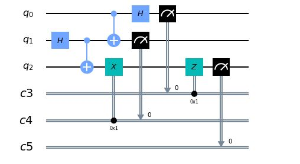

In this [Qiskit
Notebook](https://github.com/samlip-blip/quantum_teleportation/blob/master/QuantumTeleportation.ipynb)
we will attempt to go into the details of the **Quantum Teleportation**.

Just recently physicists achieved the first-ever [quantum
teleportation](https://www.nature.com/articles/s41567-019-0727-x) between
computer chips.  
The heart of the quantum teleportation is [quantum
entanglement](https://en.wikipedia.org/wiki/Quantum_entanglement) phenomenon.  
An entangled system is one whose quantum state cannot be written as a product of
states of its local constituents. In other words, constituents are not parts but
are inseparable whole. One constituent cannot be fully described without
considering the other(s).

As the notebook will show, the state of the entangled system is expressed as a
superposition (sum) of products of states of local constituents and this sum has
necessarily more than one term.  
The notebook will also show a necessity of working out related math to
understand respective histograms of the results.

After a short description of the quantum teleportation circuit which is
displayed below

we examine first 𝜙\>=\|0\> and 𝜙\>=\|1\> cases before we attempt a general

\|𝜙\>=𝛼\|0\> + 𝛽\|1\> case. Two examples are provided to illustrate and better
understand the general case.  
We finish the notebook with some modifications of the quantum teleportation
circuit.
