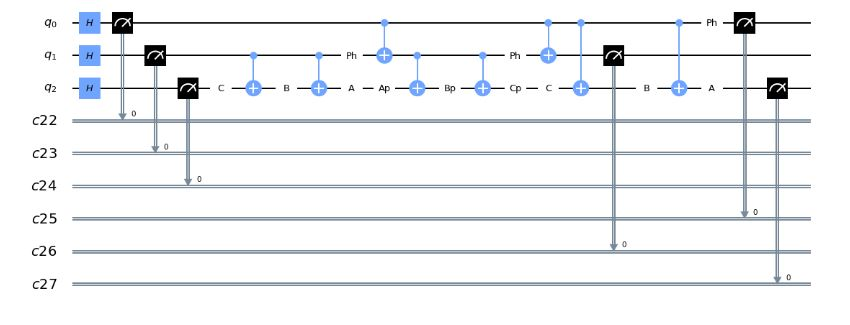

Fun with elementary gates for quantum computation
=================================================

 

In reference [1] it was shown that a set of gates that consists of all one-bit
quantum gates and the two-bit exclusive-or gate is universal in the sense that
all unitary operations on arbitrary many bits can be expressed as compositions
of these gates.

  
In this Qiskit
[notebook](<https://github.com/samlip-blip/FunWithQCircuits/blob/master/FascinatingQCircuits.ipynb>)
we are interested in constructing a gate V such that VxV=X (NOT) gate. Thanks to
Lemma 4.3 from the reference [1] V gate can be easily expressed in terms of
elementary gates. A cool thing about this is, if we have V gate, we can follow
Lemma 6.1 from the same reference and construct a Toffoli gate.

 

[1] <https://arxiv.org/abs/quant-ph/9503016>

 

The quantum circuit for our construction of the Toffoli gate is displayed below.

 

The pdf version of the notebook can be found
[here](https://github.com/samlip-blip/FunWithQCircuits/blob/master/FascinatingQCircuits.pdf)

 
