 

**1. Introduction** 
--------------------

**1.1 Background**

According to Wikipedia [1], UFO is the popular term for any aerial phenomenon
that cannot immediately be identified. The term "UFO" was created in 1953 by the
United States Air Force and in its initial definition, it was "any airborne
object which by performance, aerodynamic characteristics, or unusual features,
does not conform to any presently known aircraft or missile type, or which
cannot be positively identified as a familiar object." The Oxford English
Dictionary defines a UFO as "An unidentified flying object; a 'flying saucer'."
In widely known usage, the term UFO corresponds to claims of alien spacecraft.

Unexplained aerial observations have been described throughout history. For
example, on April 14, 1561, residents of Nuremberg described the appearance of a
large black triangular object. They described also hundreds of spheres,
cylinders and other odd-shaped objects that moved erratically overhead. On
January 25, 1878, the Denison Daily News published an article in which John
Martin, a local farmer, had reported seeing a large, dark, circular object
resembling a balloon flying "at wonderful speed." It appeared to be about the
size of a saucer, one of the first uses of the word "saucer" in association with
a UFO. These are just two examples. Some of these observations were undeniably
astronomical in nature: comets, bright meteors, one or more of the five planets
that can be freely seen with the naked eye, planetary conjunctions (an apparent
meeting or passing of two or more planets), or atmospheric optical phenomena
such as parhelia (a phenomenon that consists of a bright spot to one or both
sides of the Sun) and lenticular clouds (lentil shaped stationary clouds).

The majority of UFO observations are, according to studies, misidentified
conventional objects or natural phenomena - like aircrafts, balloons,
satellites, or meteors, bright stars, and planets. A small percentage are hoaxes
and fewer than 10% of reported sightings remain unexplained after proper
investigation, and therefore can be classified as unidentified in the strictest
sense. However, the null hypothesis cannot be excluded for these reports in a
sense that they are simply other phenomena that cannot be identified due to lack
of respective information. Advocates of the extraterrestrial hypothesis suggest
that these unexplained reports are of alien spacecraft. Almost no scientific
papers about UFOs have been published in peer-reviewed journals. The general
conclusion in the scientific community was that the phenomenon was not worthy of
serious investigation except as a cultural artifact.

 

[1]. <https://en.wikipedia.org/wiki/Unidentified_flying_object>

 

**1.2 Problem**

In this project we will try to reveal a story the UFO observational data is
telling about the UFO phenomenon. When the above general conclusion was reached
data science as a discipline did not exist. There are now publicly available
datasets about UFO observations which can be freely used. If we combine these
two ingredients, a free available UFO dataset and data science we can unlock
insights about the UFO phenomenon. Every data tells a story and the story is of
paramount importance for forming an honest opinion about a particular
phenomenon. So what story is the UFO observational data telling? Our problem is
to attempt to reveal this story.

 

**1.3 Interest**

This report is targeted to anyone interested in the UFO phenomenon.

 

**2. Data**
-----------

To answer our question we will use the UFO Sightings dataset [2]. This dataset
contains the sighting report content itself including the time, location,
duration, and other attributes in both the raw form as it is recorded on the
National UFO Research Center (NUFORC) site as well as a refined, thanks to Tim
Renner, standardized form that also contains latitude/longitude coordinates. We
will use the refined form
( <https://data.world/timothyrenner/ufo-sightings/workspace/file?filename=nuforc_reports.csv> )
which has cleaned state and city names, standardized dates and
latitude/longitude values of the cities in which the sightings occurred. Few
things to note:

1.  All of the sighting reports are present - this is a complete scrape.

2.  The entire sighting report contents are present, including the full text of
    the sighting report.

3.  The sighting reports are geocoded at the city level. It isn't a complete
    geocoding, but about 90k / 110k reports have an associated lat/lon.

4.  The "cleaned" version of the dataset has a few key standardizations applied
    like date times, city names, state codes, etc that make it easier to work
    with.

 

Columns information:

1.  **summary**: Summary of the report. Usually the first few sentences.

2.  city: The city of the sighting.

3.  state: The 2 character state code of the sighting.

4.  date_time: The date and time of the sighting in ISO 8601 (local time).

5.  shape: The shape of the sighting.

6.  duration: The duration of the sighting in no particular format.

7.  stats: Summary stats about the sighting (when it occurred, when it was
    posted, etc.).

8.  report_link: A link to the original report on the NUFORC site.

9.  **text**: The text of the sighting report.

10. posted: When the sighting was posted to the NUFORC site.

11. city_latitude: The latitude of the city in which the sighting occurred.

12. city_longitude: The longitude of the city in which the sighting occurred.

 

[2]. <https://data.world/timothyrenner/ufo-sightings>

 

**3. Methodology**
------------------

We will focus on the **summary** and **text** columns of our dataset since these
columns contain the report information about the sighting event. Based on the
information in these columns a list of words used to describe the UFO phenomenon
will be constructed.

Specifically, some steps of Natural language processing (NLP) [3] analysis will
be applied to this information. NLP is an area of computer science and
artificial intelligence concerned with the interactions between computers and
human (natural) languages, in particular how to program computers to process and
analyze large amounts of natural language data. It is the branch of machine
learning which is about analyzing any text and handling predictive analysis.
Text cleaning or preprocessing in our case will include removing punctuations
and other non-alphanumeric characters, numbers, stop words and words with the
length \<= 2 since all these entities do not help much in processing the
information about sighting events and converting every remaining word to its
lower case. After this preprocessing step we will calculate the frequency of the
remaining words and create a list of these words sorted in descending order by
the frequency so that the most frequent words are at the beginning of the list
(ufo_words_list in the notebook).

Using WordNet [4] we will identify nouns, verbs, adjectives and adverbs in this
list. WordNet is a large lexical database of English. Nouns, verbs, adjectives
and adverbs are grouped into sets of cognitive synonyms (synsets), each
expressing a distinct concept. Synsets are interlinked by means of
conceptual-semantic and lexical relations. WordNet is a useful tool for
computational linguistics and Natural language processing. To get a visual sense
of the most frequent nouns, verbs, adjectives and adverbs used to describe the
UFO phenomenon we will create a bar plot of the 100 most frequent entries for
each of these 4 word classes.

Next, stemming will be done which is taking roots of every word in the list. A
bar plot of the 100 most frequent stem words will be created to get a feeling
for the most frequent root words used to describe the UFO phenomenon. We will
focus our attention on the top 50 stem words and create a word cloud of these
words to visually summarize the insights. We will sample sentences from the
sighting reports containing one or more of these top 50 stem words to get an
understanding how these stem words are used in the description of the UFO
phenomenon.

Finally, using our list we will proceed to calculate the information entropy for
each sighting report in the dataset. The information entropy quantifies how much
information there is in a message. The intuition behind quantifying information
[5] is the idea of measuring how much surprise there is in an event. Those
events that are rare (low probability) are more surprising and therefore have
more information than those events that are common (high probability). In other
words, higher information entropy of a message does mean higher information
content is in the message. The dataset will be sorted in descending order by the
information entropy of the sighting reports and we will examine some reports
with the largest entropy. These reports should be more surprising than the
lowest entropy reports.

After all these steps we can attempt to reveal the story the UFO observational
data is telling about the UFO phenomenon.

 

[3]. <https://www.geeksforgeeks.org/python-nlp-analysis-of-restaurant-reviews/>

[4]. <https://wordnet.princeton.edu/>

[5]. <https://machinelearningmastery.com/what-is-information-entropy/>

 

**4. Analysis**
---------------

[A Python 3 Jupiter notebook in the IBM Watson
Studio](https://github.com/samlip-blip/ufo_analysis/blob/master/UFOAnalysis_fnl.ipynb)
is used to run analysis and produce results.

More information about notebooks in the IBM Watson Studio can be found
[here](https://dataplatform.cloud.ibm.com/docs/content/wsj/analyze-data/notebooks-parent.html).

 

**4.1 Basic Explanatory Analysis**

Basic explanatory analysis shows that there is no difference whether we check
for NaN or null values. The stats are the same. The **report_link** column is
always populated. However, there are 54 rows where the **text** column value is
not populated.

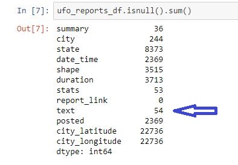

A quick glance at the **summary** column reveals that the **summary** column is
always populated for these 54 rows except for the 54th row.

We see that there is one row in our data where both **summary** and **text**
values are NaN. This row does not have any information about the sighting report
so we will remove it. For the remaining rows we can use the **summary** value
when respective **text** value is NaN. This can be accomplished by creating a
new column called *text_mining_info* which will be the **text** when the
**text** is populated, otherwise it will be the **summary** when the **text** is
NaN. We will use the *text_mining_info* column in our analysis. Specifically,
text cleaning will be applied to this column.

 

**4.2 The NLP analysis - text cleaning**

In order to run the NLP analysis we first need to install necessary libraries.

~~~~~~~~~~~~~~~~~~~~~~~~~~~~~~~~~~~~~~~~~~~~~~~~~~~~~~~~~~~~~~~~~~~~~~~~~~~~~~~~
!conda install -c conda-forge  nltk --yes
~~~~~~~~~~~~~~~~~~~~~~~~~~~~~~~~~~~~~~~~~~~~~~~~~~~~~~~~~~~~~~~~~~~~~~~~~~~~~~~~

Then we remove any number from the text_mining_info. We convert every word in
the text_mining_info to its lower case. We replace all non-alphanumeric
characters in the text_mining_info with a blank and keep only one blank between
2 words. Next we split such modified text_mining_info on the blank and create a
list of the remaining words. Essentially, we convert the information from every
sighting report into a respective list of words. Now for each of these lists we
remove stop words which are generally the most common words in a language, like
words below.

~~~~~~~~~~~~~~~~~~~~~~~~~~~~~~~~~~~~~~~~~~~~~~~~~~~~~~~~~~~~~~~~~~~~~~~~~~~~~~~~
explore_text_mining_info_df["mining_info"]=explore_text_mining_info_df["text_mining_info_no_non_alpha_array"].apply(lambda x: [item for item in x if item not in stop_words])
~~~~~~~~~~~~~~~~~~~~~~~~~~~~~~~~~~~~~~~~~~~~~~~~~~~~~~~~~~~~~~~~~~~~~~~~~~~~~~~~

Finally for each of the lists we remove words with the length \<= 2.

~~~~~~~~~~~~~~~~~~~~~~~~~~~~~~~~~~~~~~~~~~~~~~~~~~~~~~~~~~~~~~~~~~~~~~~~~~~~~~~~
explore_text_mining_info_df["mining_info2"]=explore_text_mining_info_df["mining_info"].apply(lambda x: [item for item in x if len(item) > 2])
~~~~~~~~~~~~~~~~~~~~~~~~~~~~~~~~~~~~~~~~~~~~~~~~~~~~~~~~~~~~~~~~~~~~~~~~~~~~~~~~

At this point we have converted the information from every sighting report into
a desirable list of words. A lot of lists were created, 112094 to be exact. Now
we want to combine all these lists into one list. Unfortunately, a very
convenient statement like this: *ufo_list
=np.concatenate(explore_text_mining_info_df.mining_info2.values)* would cause
the kernel of the notebook to die.

 

**4.3 Dealing with dying kernel**

It turned out that a simple divide and conquer strategy was enough to avoid the
death of the kernel. So we split out respective dataframe into 10 smaller
dataframes and create 10 corresponding lists and work with them.

We loop through 10 dataframes and for each dataframe we perform these steps:

-   concatenate respective words into a ufo_list variable

-   convert the ufo_list into a ufo_list_df dataframe, one word per row

-   create respective summary dataframe to keep words counts and their
    respective percentages of the total number of the ufo_list_dt rows.

-   keep only words with percentages greater than 0.001 percent.

0.001 percent cutoff is determined by trail and error. It is the first value at
which the kernel started dying, meaning we could not use lower order magnitude
values for the cutoff. These 10 summary dataframes are concatenated and
respective words counts and percentages are recalculated since some words
appeared in more than one dataframe (see the notebook for details). We also
added for each word respective probability (prob) which is simply perc_tot/100.
Below is a snapshot of the head records of the sorted final dataframe by the
count in descending order.

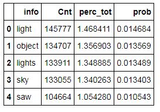

**4.4 The list of words used to describe the UFO phenomenon**

The list of words used to describe the UFO phenomenon is the info column of the
above dataframe. First 30 most frequent words in the list are displayed.

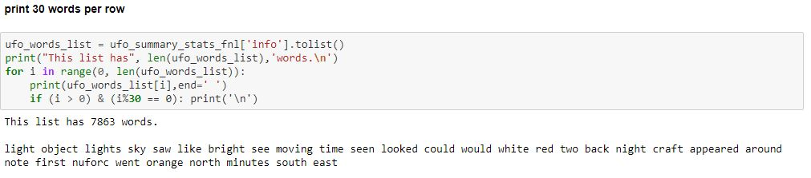

We see that the first few words suggest some bright moving object in the sky and
light, lights as the most common words used to describe the UFO phenomenon.

 

**4.5 The NLP analysis - Identify nouns, verbs, adverbs and adjectives in the
list**

As was mentioned in the Methodology section we use WordNet for this task and
find that most of the words in the list are nouns. Interestingly, there are 931
words that are classified as ‘None’.

~~~~~~~~~~~~~~~~~~~~~~~~~~~~~~~~~~~~~~~~~~~~~~~~~~~~~~~~~~~~~~~~~~~~~~~~~~~~~~~~
noun    4677
verb    1395
None     931
adj      561
adv      299
~~~~~~~~~~~~~~~~~~~~~~~~~~~~~~~~~~~~~~~~~~~~~~~~~~~~~~~~~~~~~~~~~~~~~~~~~~~~~~~~

If we list these ‘None’ words we can easily see that ‘would’, ‘could’, ‘since’,
‘else’, ..., etc. are in this group so ‘None’ words in essence do not carry
information important for the description of the UFO phenomenon and we remove
these words from the list.

 

**4.6 The NLP analysis - Stemming**

To take main stem of each word in the list a PorterStemmer object is created and
used.

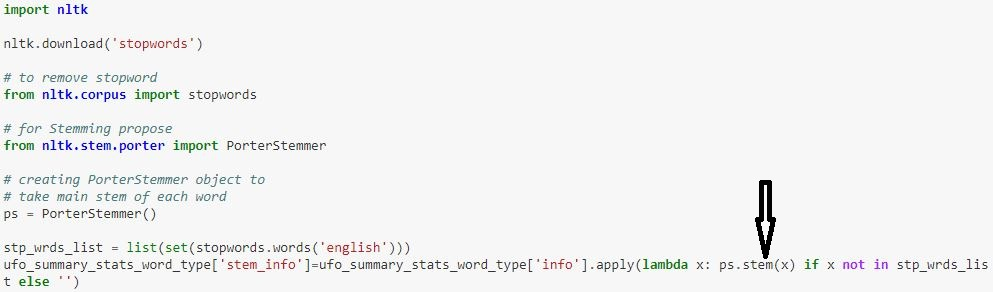

Stem words are summarized by counts and percentages.

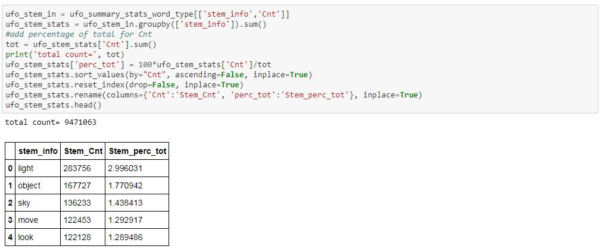

The bar plot below of the 100 most frequent stem words shades a light on most
often root words used to describe the UFO phenomenon. It seems all action is in
the first half of the plot with ‘light’ as a very distinguished lead stem word.

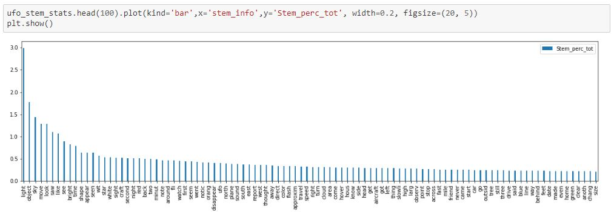

**4.7 The information entropy**

Finally we calculate the information entropy for each sighting report. Each word
of the sighting report is searched in the dictionary that contains words and
respective probabilities

~~~~~~~~~~~~~~~~~~~~~~~~~~~~~~~~~~~~~~~~~~~~~~~~~~~~~~~~~~~~~~~~~~~~~~~~~~~~~~~~
ufo_dict_in = ufo_summary_stats_word_type[['info','prob']]
ufo_words_dict = dict(ufo_dict_in.values.tolist())
~~~~~~~~~~~~~~~~~~~~~~~~~~~~~~~~~~~~~~~~~~~~~~~~~~~~~~~~~~~~~~~~~~~~~~~~~~~~~~~~

and if found respective probability is added to a ‘score’.

~~~~~~~~~~~~~~~~~~~~~~~~~~~~~~~~~~~~~~~~~~~~~~~~~~~~~~~~~~~~~~~~~~~~~~~~~~~~~~~~
explore_text_mining_info_df['score']=explore_text_mining_info_df['mining_info2'].apply(lambda x: [ufo_words_dict[item] for item in x if item in ufo_words_dict.keys()])
~~~~~~~~~~~~~~~~~~~~~~~~~~~~~~~~~~~~~~~~~~~~~~~~~~~~~~~~~~~~~~~~~~~~~~~~~~~~~~~~

Essentially, each sighting report is converted into a list of probabilities and
using this list respective entropy is calculated as

~~~~~~~~~~~~~~~~~~~~~~~~~~~~~~~~~~~~~~~~~~~~~~~~~~~~~~~~~~~~~~~~~~~~~~~~~~~~~~~~
explore_text_mining_info_df['entropy']=explore_text_mining_info_df['score'].apply(lambda x: sum([-item*np.log2(item) for item in x if item > 0]))
~~~~~~~~~~~~~~~~~~~~~~~~~~~~~~~~~~~~~~~~~~~~~~~~~~~~~~~~~~~~~~~~~~~~~~~~~~~~~~~~

which is

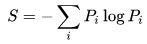

formula where the log function uses base 2. Sighting reports are sorted by the
entropy in descending order. Out of curiosity, the summary information for the
top 6 sighting reports is displayed below.

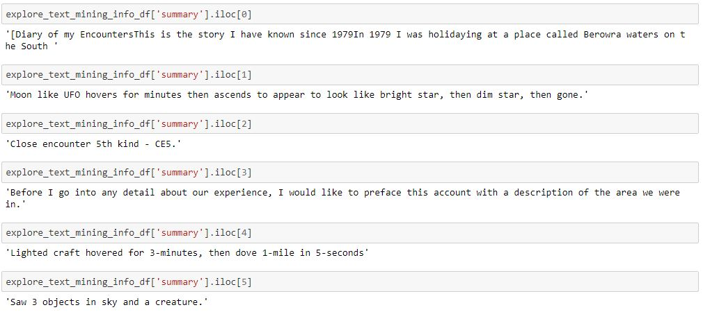

Certainly, the third and sixth are quite intriguing.

 

**5. Results**
--------------

Bar plots below give us a visual sense of the most frequent nouns, verbs,
adjectives and adverbs used to describe the UFO phenomenon for the 100 most
frequent entries for each of these 4 word classes.

**nouns**

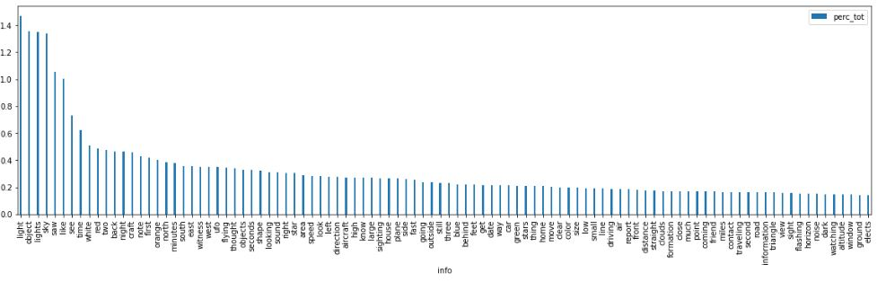

Clearly, ‘light’, ‘object’, ‘lights’, and ‘sky’ are leading nouns. It is
interesting ‘saw’ and ‘see’ are classified by WordNet as nouns although we would
expect for ‘see’ to be a verb and for ‘saw’ to be past tense of see.

**verbs**

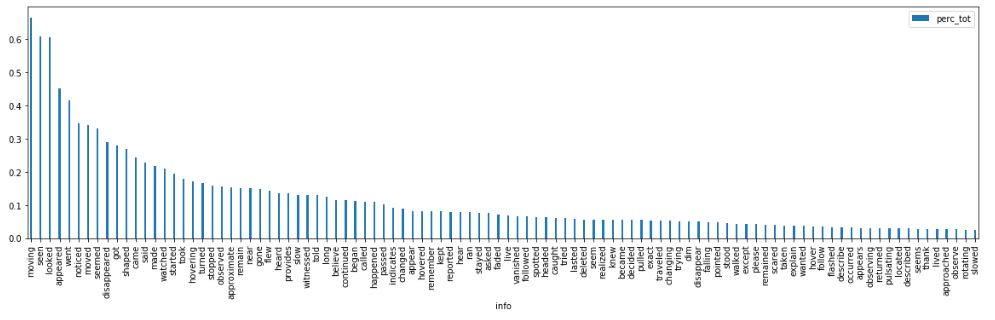

The leading verbs are ‘moving’, ‘seen’, and ‘looked’.

**adverbs**

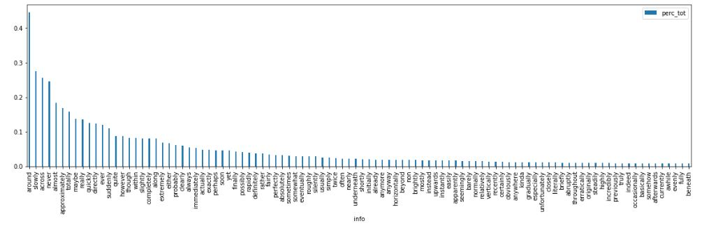

‘around’ is the top adverb while ‘bright’ is the top adjective.

**adjectives**

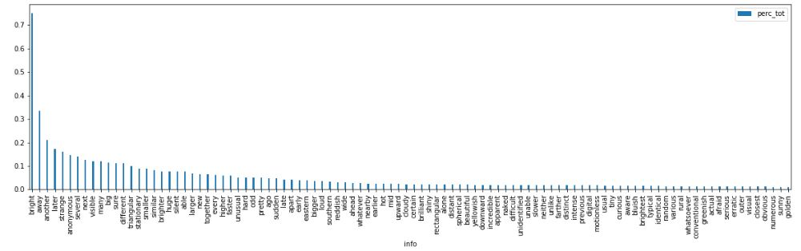

To make it easy to spot frequencies of the top 50 stem words used to describe
the UFO phenomenon we created a Word Cloud.

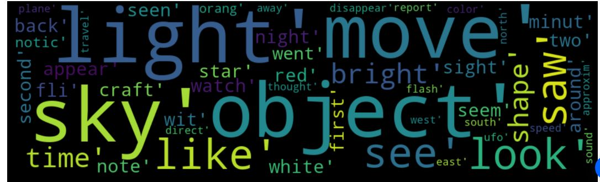

We also list the top 50 stem words.

~~~~~~~~~~~~~~~~~~~~~~~~~~~~~~~~~~~~~~~~~~~~~~~~~~~~~~~~~~~~~~~~~~~~~~~~~~~~~~~~
light object sky move look saw like see bright time shape 

appear seen wit star white sight craft second night red 

back two minut note around fli watch first seem went 

notic orang disappear ufo north plane sound south east report 

west thought away direct color flash approxim travel speed 
~~~~~~~~~~~~~~~~~~~~~~~~~~~~~~~~~~~~~~~~~~~~~~~~~~~~~~~~~~~~~~~~~~~~~~~~~~~~~~~~

In order to gain understanding how these root words are used to describe the UFO
phenomenon we did sample sentences from the sighting reports containing one or
more of these words. This wasn’t anything fancy, we just limited our pool to the
first 10000 reports and focused on the reports with the largest numbers of
sentences in which these words appeared.

Here are the links for some of the reports:

<http://www.nuforc.org/webreports/010/S10250.html> (bright surrounding
light,banging on car, animal life affected)
<http://www.nuforc.org/webreports/011/S11956.html> (abduction to underground
facility)

<http://www.nuforc.org/webreports/011/S11676.html> (two bright objects
perpendicular to one another)

<http://www.nuforc.org/webreports/014/S14868.html> (one bright object which
turned into eleven)

<http://www.nuforc.org/webreports/011/S11868.html> (teardrop shape)

<http://www.nuforc.org/webreports/133/S133485.html> (changing shape)

<http://www.nuforc.org/webreports/132/S132745.html> (fluid formation flying
disks)

<http://www.nuforc.org/webreports/133/S133288.html> (observed green star)

<http://www.nuforc.org/webreports/009/S09604.html> (craft floated and made no
noise)

<http://www.nuforc.org/webreports/004/S04806.html> (5-8 smaller objects began to
fall out of the larger object)

<http://www.nuforc.org/webreports/004/S04195.html> (if you look at it's lights
it can affect you emotionally)

<http://www.nuforc.org/webreports/006/S06339.html> (light in the sky that
changes color)

<http://www.nuforc.org/webreports/003/S03372.html> (memory gaps)

<http://www.nuforc.org/webreports/002/S02047.html> (drain the power from the
battery of car)

<http://www.nuforc.org/webreports/003/S03291.html> (S-pattern)

http://www.nuforc.org/webreports/011/S11772.html (not from this world!)

http://www.nuforc.org/webreports/010/S10553.html (thousands report UFO in Papua
New Guinea)

<http://www.nuforc.org/webreports/132/S132430.html> (glowing light that moved,
stopped, glew brighter etc.)

<http://www.nuforc.org/webreports/007/S07673.html> (loop over each other)

<http://www.nuforc.org/webreports/008/S08795.html> (the light just sucked up in
nothing and vanished)

<http://www.nuforc.org/webreports/004/S04967.html> (it hovered for a few seconds
and then disappeared)

<http://www.nuforc.org/webreports/003/S03298.html> ("no plane I know can do
this")

<http://www.nuforc.org/webreports/008/S08101.html> (the CD mysteriously played
backwards!)

<http://www.nuforc.org/webreports/005/S05196.html> (zig zag)

<http://www.nuforc.org/webreports/005/S05813.html> (THERE WAS NO SOUND COMING
FROM THIS OBJECT)

<http://www.nuforc.org/webreports/008/S08439.html> (flashing lights)

<http://www.nuforc.org/webreports/009/S09627.html> (intense UFO encounter sites)

<http://www.nuforc.org/webreports/011/S11867.html> (object travels at great
speed, suddenly changes direction)

<http://www.nuforc.org/webreports/013/S13847.html> (extraordinary
maneuverability and speed)

 

The reports suggest these fascinating fragments of the story the UFO
observational data is telling about the UFO phenomenon:

~~~~~~~~~~~~~~~~~~~~~~~~~~~~~~~~~~~~~~~~~~~~~~~~~~~~~~~~~~~~~~~~~~~~~~~~~~~~~~~~
It is about a moving, bright object or objects in the sky with distinct light features, extraordinary, unusual, flying characteristics, power to affect nearby things or living beings and some noticeable, sometimes, changing shape.

The object can look like a colorful light in the sky that changes color, for example, from red to green to yellow, the light can be flashing or the light that disappears or the object looks like a moving star. For example, "glowing light that moved, stopped, glowed brighter and dimmed out" or "right before it would have hit plane, the light just sucked up in nothing and vanished".

It seems if you look at the object’s lights it can affect you emotionally!

These objects can hover and disappear, move erratically, like zig zag, can float and make absolutely no noise or sound.

The object can be a silent airborne object and can come to a complete, sudden stop and smaller objects can fall out of the object.

These objects can fly in a perfect formation like a perfect line or in a strange formation, for example S-shaped pattern, can loop over each other and display extraordinary maneuverability and speed and can suddenly change direction.

It looks the object can somehow affect the memory of a person looking at it, causing memory gaps!

Besides causing electrical failures in the car, wipers beating windshields, etc. the object can affect animal life as well.

It looks when these objects are around, CD players and radios can mysteriously play the CD backwards!

The objects can drain the power from the battery of car, seems to hear what a person was thinking and entities can abduct the person.

The most frequent 5 shapes for these objects are light, circle, triangle, fireball or unknown.

Sometimes many people witness these objects (see Thousands report UFO in Papua New Guinea) and some areas are intense UFO encounter sites.

These things look not from this world!
~~~~~~~~~~~~~~~~~~~~~~~~~~~~~~~~~~~~~~~~~~~~~~~~~~~~~~~~~~~~~~~~~~~~~~~~~~~~~~~~

Finally, these are the links for the top 6 sighting reports based on the
information entropy that we listed in 4.7 section:

1.  <http://www.nuforc.org/webreports/002/S02047.html>

2.  <http://www.nuforc.org/webreports/086/S86119.html>

3.  <http://www.nuforc.org/webreports/117/S117952.html>

4.  <http://www.nuforc.org/webreports/072/S72574.html>

5.  <http://www.nuforc.org/webreports/116/S116501.html>

6.  <http://www.nuforc.org/webreports/109/S109660.html>

 

The third report is about a Close Encounter of the Fifth Kind which Wikipedia
defines as “a UFO event that involves direct communication between aliens and
humans” [6].

 

[6].
<https://en.wikipedia.org/wiki/Close_encounter#Close_Encounters_of_the_Fifth_Kind>

 

Some captivating parts of that report:

~~~~~~~~~~~~~~~~~~~~~~~~~~~~~~~~~~~~~~~~~~~~~~~~~~~~~~~~~~~~~~~~~~~~~~~~~~~~~~~~
The disk was still flying toward us, slowly, maybe 20-mph. It flew the same way over the canal until about 300-yards away. Then it went gradually higher to about 400-yards, almost over head. It’s changing direction slightly now, moving to the opposite edge of the canal and over a point about 100-yards in front of us. It slowed, descending as it went by. It’s absurd not being aware that it’s a UFO but it never entered my mind. A UFO is exactly what we saw, the real thing. I never saw one before and this one is really close. It didn’t get closer than 200-yards to where we stood. As the craft flew by, it was perfectly circular, about 35-feet in diameter give or take five. At that height it looks bigger than, say, a full moon rising on the horizon and it’s brighter. As it moved it made a bright white glow with a hint of yellow, bright but without a strain... easy on the eyes....

Here’s what happened. We watched as the craft came lower, stopped, and became darker. Two small lights appeared. The craft was parked in the air just inside the levee of Big Lake maybe as close as 200-yards away. As we watched, something hit me, a marvelously happy feeling and I knew at the time it was coming from the craft. I thought THIS is a really good sign whoever they are....

The happiest feeling of anticipation had suddenly come upon me. I knew to expect something wonderful to happen between them and me. They were doing something to affect my mental state giving me a wonderful feeling of euphoria. It‘s nothing like anything I’ve ever felt, a totally joyful happy feeling beyond description. I was so glad they were here and understood, waiting for something. I dared not move a muscle although knew I wasn’t restrained. Whatever came next I wanted to be part of it. Next, I was sensing a projection of thought to me, when soon thought-speech appeared in mind in my own idiom....
~~~~~~~~~~~~~~~~~~~~~~~~~~~~~~~~~~~~~~~~~~~~~~~~~~~~~~~~~~~~~~~~~~~~~~~~~~~~~~~~

 

The most bizarre part of the 6th report is a description of a possible
extraterrestrial biological entity:

~~~~~~~~~~~~~~~~~~~~~~~~~~~~~~~~~~~~~~~~~~~~~~~~~~~~~~~~~~~~~~~~~~~~~~~~~~~~~~~~
Once back on the interstate I drove for quite some time when finally I just had to pull off. By this time it was after midnight. I took a well lit exit and saw a Wendy’s but it was only open for drive through. All of the gas stations were closed. All the while I’m checking the skies. So, I got back on I-77 and looked for another exit. That’s when I saw a Shell station sign and took that exit. It was on the left side so we had to go over the overpass. We could tell it was closed as soon as we came over the overpass. All of the parking lot lights were on but it was closed. I was in pain because my bladder was hurting now. I pulled partially into the entrance of the Shell station and then made a u turn. As I completed the u turn we saw a guard rail right in front of us. 

At the very end of the guard rail as we were swinging around we saw something standing there. I couldn’t take my eyes off of it. It was right next to the road. Right next to the door of the car. It seemed to be! bristling. Like it was luminescent in some way, but it was really darkly colored like it was camouflaged. I actually thought it was someone dressed up in that camouflage netting stuff when it moved towards the glass right next to my daughter. She put her hands and arms up over her face and head and tucked her head downwards. That is how close that thing was to her door. I honestly thought it may have been a poacher until I could make out the shape of it. I could see a larger than normal rounded top of a head then it came down to a short little neck area then straight out to both sides to shoulders. (Human shoulders aren’t shaped that way.) Then it’s arms dropped straight down. The thing that made me realize that it wasn’t human was mostly that it’s waist was only like 8 inches wide and that it was about maybe 4 feet tall. I could see from the top of it’s head to its hip area through her window. I remember thinking “It’s so skinny!” Next thing I know we are past it and my daughter is asking me, “Was that a person?” I remember looking back over my right shoulder through the window behind her and still seeing the thing. It was moving and I had never been so terrified in my entire life. 

My daughter said that she didn’t look at it but then moments later she said that it was really thin. I remember asking her how do you know that if you didn’t look at it? She still can’t answer that question, but is adamant about not looking at it.
~~~~~~~~~~~~~~~~~~~~~~~~~~~~~~~~~~~~~~~~~~~~~~~~~~~~~~~~~~~~~~~~~~~~~~~~~~~~~~~~

 

Besides a possible abduction in both cases, what is so striking about the 6th
report is that points to a possible occurrence of missing time:

~~~~~~~~~~~~~~~~~~~~~~~~~~~~~~~~~~~~~~~~~~~~~~~~~~~~~~~~~~~~~~~~~~~~~~~~~~~~~~~~
Strange thing is that the clock on her cell and the register receipt didn’t match. The receipt said we left there at 10:05 and my daughter had gotten a call from her husband while we were at the table and the time read 10:46. That would mean that by her cell we left there after 11:00 PM. I know we weren’t sitting there for that long. I called the Denny’s last week and spoke to a manager to see if the register’s time was off. But, it was accurate. I can’t explain the difference.
~~~~~~~~~~~~~~~~~~~~~~~~~~~~~~~~~~~~~~~~~~~~~~~~~~~~~~~~~~~~~~~~~~~~~~~~~~~~~~~~

 

Feel free to click on the links for these 2 reports or any of the above reports
to explore them.

 

**6. Discussion**
-----------------

In his book [7] Allen Hynek established **beyond reasonable doubt** that UFO
cases are not **all** misperceptions or hoaxes. Publicly available datasets
about the UFO observations allow us to explore freely the sighting reports not
for the sake of their story value, but for the insights what people have
actually experienced that witnessed these things. Our problem was to reveal a
story the UFO observational data is telling about the UFO phenomenon. We
combined two ingredients, a free available UFO dataset and data science to
unlock insights about the UFO phenomenon. In other words, we did focus on the
narrative derived from the data and analysis based on the Natural language
processing, stemming and calculation of the information entropy. Essentially we
did build a list of words used to describe the UFO phenomenon along with their
respective frequencies and we did focus on the 50 most frequent stem words.
Using the information entropy to quantify how much information there is in each
sighting report and looking at the top sighting reports in the information
entropy we did reveal some aspects of the UFO phenomenon, for example abduction
and occurrence of missing time, that were not captured by the 50 most frequent
stem words. For example, stem words related to abduction and occurrence of
missing time are abduct and clock and they are on 1239th and 559th place
respectively in the list of the stem words.

Due to the dying kernel, with our simple divide and conquer strategy to avoid
the kernel death, we were only able to keep words with percentages greater than
0.001 percent in the list (see the section 4.3 for details). This means after
all 10 splits were processed we were able to include only about 17% of all words
in the list as it can be seen from the stats below

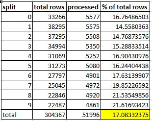

This means that we were able to uncover only fragments of the story, but even
these fragments will definitely capture the imagination of readers. To capture
the full story the UFO observational data is telling about the UFO phenomenon
additional methodology and analysis is needed to process all words, for example
MapReduce approach in which the work is divided into smaller parts. Each part is
processed independently in parallel on the cluster of servers to get individual
outputs. These outputs are further processed to get the final output. Building a
complete list of words used to describe the UFO phenomenon along with their
respective frequencies is the word count MapReduce problem that can be easily
solved in the MapReduce framework ([word
count](https://riptutorial.com/hadoop/example/13413/word-count-program-in-java---python-)).
Our gut feeling is that we should not expect significant changes in what we
uncovered so far by including low frequency words (0.001 percent or less) in the
list.

Even with the fragmentary information extracted by our approach we can see that
the full story is going to be incredible, about things that look not from our
everyday world. The story will be about moving, bright object or objects in the
sky with distinct light features like a colorful light in the sky that changes
color or like the light that just sucked up in nothing and vanished.

Their flying characteristics are unusual, extraordinary. These objects can hover
and disappear, move erratically, like zig zag, can float and make absolutely no
noise or sound. For example, the object can come to a complete, sudden stop and
smaller objects can fall out of the object. Or the objects can fly in a perfect
formation like a perfect line or in a strange formation, like S-shaped pattern,
can loop over each other and display extraordinary maneuverability and speed and
can suddenly change direction.

The objects have power to affect nearby things or living beings. For example, it
seems if you look at the object’s lights it can affect you emotionally! Or it
looks the object can somehow affect the memory of a person looking at it,
causing memory gaps! They can affect animal life as well and drain the power
from the battery of car, cause wipers beating windshields and it seems they can
hear what a person was thinking. It looks when these objects are around, CD
players and radios can mysteriously play the CD backwards and they can cause
occurrence of missing time! Finally, entities in these objects can abduct the
person.

 

[7]. Hynek, Allen J. (1998) [First published 1972]. *The UFO Experience: A
Scientific Inquiry*. Da Capo
Press. [ISBN](https://en.wikipedia.org/wiki/International_Standard_Book_Number) [978-1-56924-782-2](https://en.wikipedia.org/wiki/Special:BookSources/978-1-56924-782-2).

 

**7. Conclusion**
-----------------

The purpose of this project was to attempt to reveal the story the UFO
observational data is telling about the UFO phenomenon. This story would capture
the insights what people have actually experienced that witnessed these things.
We did show that focusing on the narrative derived from the UFO observational
data and analysis based on the Natural language processing, stemming and
calculation of the information entropy we were able to uncover fascinating
fragments of the story. Information extracted by our approach so far points to
the story about things that look not from our everyday world. Future directions
include researching how to incorporate additional methodology and analysis, for
example MapReduce, to capture the full story the UFO observational data is
telling about the UFO phenomenon.
